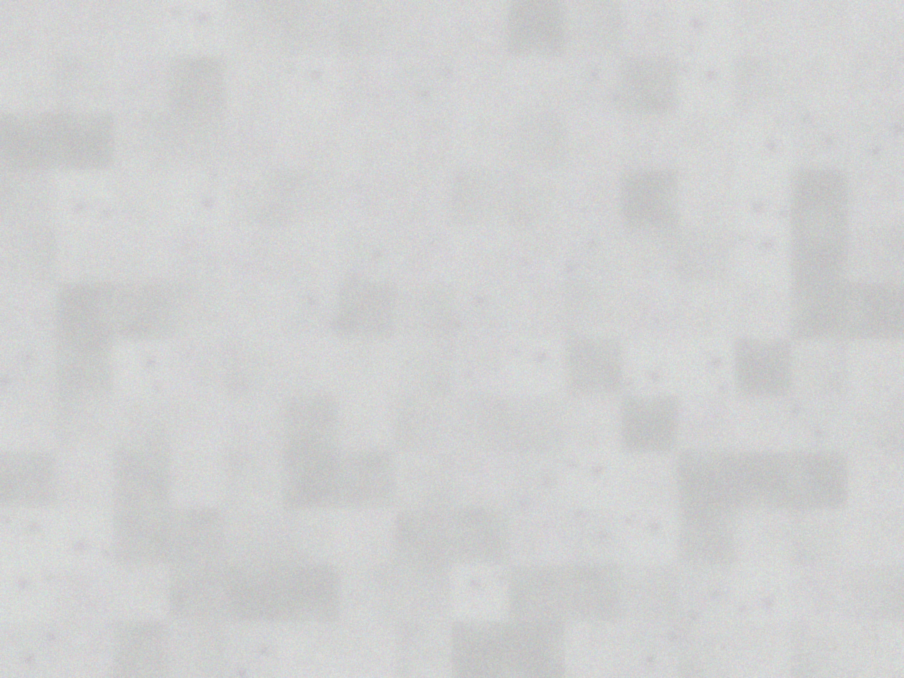
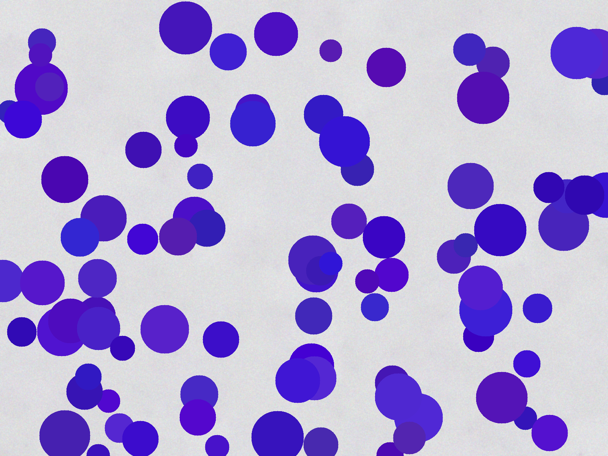
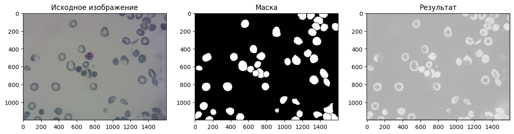
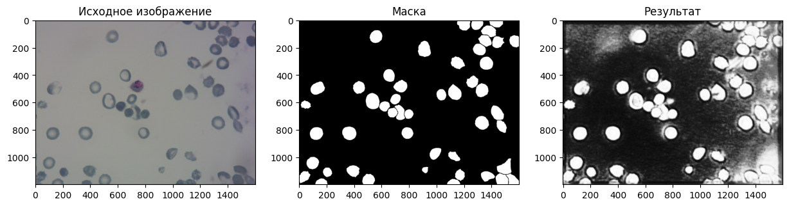
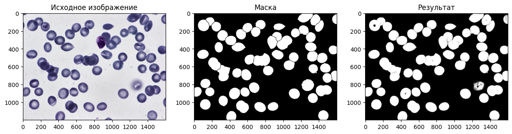
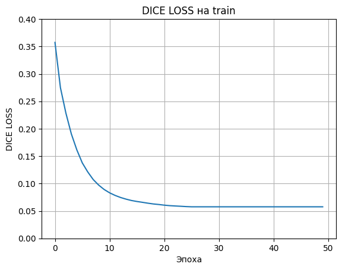
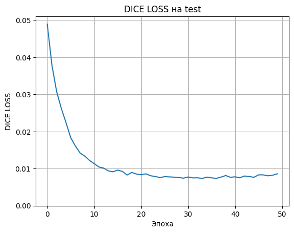

# Детекция и подсчет клеток крови человека на изображении

## Состав команды
1. Шарипов Тимур Наилевич
2. Баранов Владислав Васильевич

## Цель проекта
* Создание приложения, позволяющего детектировать клетки крови по лабораторным изображениям. Реализация для этого различных алгоритмов:
  * Классические `CV`-алгоритмы: поиск контуров и поиск форм (в данном случае - окружностей);
  * Комбинированные `CV`- и `ML`-алгоритмы: выделение признаков с помощью классических алгоритмов компьютерного 
  зрения (в данном случае - выделение текстурных признаков через `Local Binary Pattern`),
  обучение моделей `ML` для кластеризации на основе этих признаков;
  * Нейросетевой подход - обучение CNN, предсказывающей маску клеток на изображении.

## Данные
Исходные данные - набор изображений клеток крови на светлом фоне и соответствующих масок, выделяющих непосредственно клетки.
Датасет изначально разделен на `train`-часть (*1169 элементов*) и `test`-часть (*159 элементов*). Подавляющее большинство 
изображений в формате `png` и разрешением `1200x1600` пикселей, однако среди них встречаются и изображения `jpg` с иным разрешением.
В процессе предобработки данных эти аномалии были исправлены, все картинки приведены к формату `png` и размеру `1200x1600`.


## Описание архитектуры проекта
Основное графическое приложение выполнено с использованием модуля `PyQt5`. 
Выполнено разделение между `frontend` частью и `backend` частью,
которые связаны `PyqtSignal`'s.

```python
class Controller:
    def __init__(self):
        self.__create_widgets()
        self.__create_usecases()
        self.__setup_connections()
        
    def __create_widgets(self):
        self.main_window = MainWindow()

    def __create_usecases(self):
        self.usecases = UseCases()

    def __setup_connections(self):
        self.main_window.upload_image_signal.connect(self.usecases.uploaded_image_usecase)
        self.main_window.generic_signal.connect(self.usecases.generic_usecase)
        self.main_window.download_results_signal.connect(self.usecases.download_results)

        self.usecases.cells_detected_signal.connect(self.main_window.show_results)
        self.usecases.image_generated_signal.connect(self.main_window.show_base_image)

    def start(self):
        self.main_window.show()
```

Реализованные алгоритмы лежат в отдельной директории [core](./core), генератор изображений в папке [generator](./generator).
Исходные и сгенерированные данные лежат в папке [data](./data) (в случае, если у вас там не лежат исходные изображения - положите или внесите изменения в конфиг).

## Описание методов
### Генератор
Последовательность работы генератора:
1. Разделяет каждую картинку на отдельно фон (с прозрачными участками бывших клеток) и отдельно клетки (с прозрачным фоном).
2. Если при генерации надо взять реальный фон, то берет случайную картинку с "дырявым" фоном, пытается вырезать из него 
квадратные патчи и заполнить ими весь фон, как мозаикой. При этом он отсеивает патчи, на которых может быть что-то помимо фона - 
загрязнения, остатки клеток после маски, еще что-то, что может испортить однородность фона. В дальнейшем полученный пазл размывается,
дабы попытаться скрыть следы генерации.
3. Если нужно сгенерировать фон как просто заливку цветом - берет случайный "дырявый" фон, вычисляет его средний цвет и заполняет им пустой холст с нужными размерами.
4. Если нужно сгенерировать реальные клетки - берет их просто с этапа 1.
5. Если нужно нарисовать клетки как круги с заливкой - то рисует их, располагая их в случайных местах и с некоторой дисперсией в размерах.
При выборе цвета сначала выбирается базовый цвет из широкого диапазона - от синего до почти красного, а потом при рисовании клеток каждая может иметь некоторое случайное отклонение от этого базового цвета.
 
### Пример сгенерированного фона:


### Примеры сгенерированных картинок:



### Алгоритмы CV
Первично - получение бинарной маски с удалением шумов, затем определение контуров, 
для каждого из которых производится подсчёт количества кругов, которые он содержит, с помощью метода `cv2.HoughCircles`
```python
def cv_detector(image_path) -> (str, int):
    img = cv2.imread(image_path)
    gray = cv2.cvtColor(img, cv2.COLOR_BGR2GRAY)
    blur = cv2.GaussianBlur(gray, (7, 7), 0)
    _, binary = cv2.threshold(blur, 0, 255, cv2.THRESH_BINARY + cv2.THRESH_OTSU)
    kernel = cv2.getStructuringElement(cv2.MORPH_ELLIPSE, (3, 3))
    opening = cv2.morphologyEx(binary, cv2.MORPH_OPEN, kernel, iterations=0)
    _, threshold = cv2.threshold(opening, 150, 255, cv2.THRESH_BINARY_INV)
    contours, _ = cv2.findContours(threshold, cv2.RETR_EXTERNAL, cv2.CHAIN_APPROX_SIMPLE)

    circles = []

    for cnt in contours:
        mask = np.zeros_like(gray)
        cv2.drawContours(mask, [cnt], -1, 255, 1)

        circles_tmp = cv2.HoughCircles(mask, cv2.HOUGH_GRADIENT, 1, 30, param1=150, param2=15, minRadius=30,
                                       maxRadius=65)

        if circles_tmp is not None:
            circles_tmp = np.round(circles_tmp[0, :]).astype("int")
            for c in circles_tmp:
                if mask[c[1] - 1][c[0] - 1] == 0:
                    circles.append(c)

    circles = [circles]
    counts = len(circles[0])
```

### ML

#### Выделение признаков
Для выделения признаков использовался метод LBP, позволяющий визуализировать и выделить текстуру. В ходе экспериментов были
подобраны параметры (в частности, единичный радиус и 8 точек). После на результат LBP накладывается фильтр и формируется `inRange`-маска, на основе которой будет кластеризация.

#### Кластеризация
Кластеризация проводилась методом `KMeans`. Алгоритм следующий: выбирается минимально возможное кол-во клеток (у нас 10) 
и максимально возможное (у нас 100). Далее методом тернарного поиска ищется точка с максимальным значением `Silhouette Score` (с погрешностью +- 5).
Это значение считается кол-вом кластеров и кол-вом клеток на картинке соответственно.

### CNN
Модель CNN состоит из энкодера и декодера и являет собой упрощенную версию U-net. Архитектура представлена ниже:
```python
class MiniUNet(nn.Module):
    def __init__(self):
        super().__init__()
        # Encoder
        self.down1 = self._block(3, 32, 3)
        self.down2 = self._block(32, 64, 3)
        self.down3 = self._block(64, 128, 3)

        # Decoder
        self.up1 = nn.ConvTranspose2d(128, 64, kernel_size=2, stride=2)
        self.conv1 = self._block(128, 64)

        self.up2 = nn.ConvTranspose2d(64, 32, kernel_size=2, stride=2)
        self.conv2 = self._block(64, 32)

        self.out = nn.Conv2d(32, 1, kernel_size=1)

    def _block(self, in_channels, out_channels, kernel=3):
        return nn.Sequential(
            nn.Conv2d(in_channels, out_channels, kernel, padding=1),
            nn.BatchNorm2d(out_channels),
            nn.ReLU(inplace=True),
            nn.Conv2d(out_channels, out_channels, kernel, padding=1),
            nn.BatchNorm2d(out_channels),
            nn.ReLU(inplace=True)
        )
```

Модель обучалась предсказывать бинарную маску, над которой применятся простой CV-алгоритм для выделения клеток. 

### Результаты, полученные в ходе оптимизации моделей
Вот так выглядело поведение модели до обучения - как видно, никакой маски не выделяется:


Вот так выглядело поведение модели примерно на 10 эпохе обучения:


А вот так - в конце обучения (на другой картинке):


В качестве лосса использовался комбинированный Dice и BCE лоссы, код ниже:
```python
class DiceBCELoss(nn.Module):
    def __init__(self, smooth=1.0, alpha=0.5):
        super(DiceBCELoss, self).__init__()
        self.smooth = smooth
        self.alpha = alpha
        self.bce = nn.BCELoss()

    def forward(self, predictions, targets):
        # Dice part
        predictions_flat = predictions.view(-1)
        targets_flat = targets.view(-1)
        
        intersection = (predictions_flat * targets_flat).sum()
        dice_loss = 1 - (2. * intersection + self.smooth) /  (predictions_flat.sum() + targets_flat.sum() + self.smooth)
        
        # BCE part
        bce_loss = self.bce(predictions, targets)
        
        # Combined loss
        return self.alpha * dice_loss + (1 - self.alpha) * bce_loss
```

Графики значений лосса в процессе обучения:



## Результаты исполнения моделей
Примеры инференса можно найти в демо-видео

## Замечения и примечания
* ML-алгоритм хорошо работает на реальных изображениях, но сдает на сгенерированных - это потому, что он использует в первую очередь информацию о текстуре, которая сильно меняется при генерации.
* CNN чуть хуже отрабатывает на сгенерированных картинках, нежели чем на реальных - это оттого, что в обучающем наборе сгенерированных картинок было меньше.


